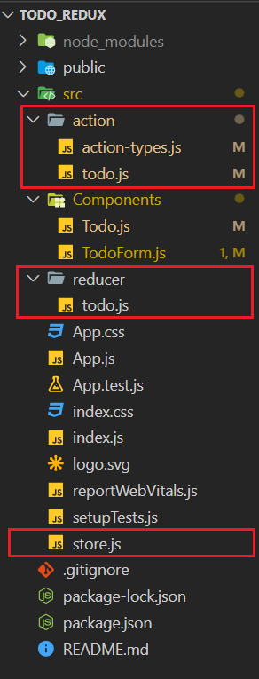

# 💥💥 React Redux Example 💥💥

#### This is an _todo_ project for understanding the concepts of redux in react

## What is Redux ?

Redux is used for **state management** for the application. It's main advantage is to overcome the problem of "props drilling" among the components.

For example, Let's assume we have 4 component named A,B,C,D and their representation is like :
A ( Parent Component )
|
B
|
C
|
D ( Lead Component )

and we have a prop named **_itemCode_** which is generated at component **A**, and only to be used at component **D**.
**`Traditional Way`** was to pass that itemCode as an prop to **B**, then **C**, and at last to **D**.

**`😎😎 How Redux Solves`** is that it makes an store for an application, which holds all the states of application at one place. So when itemCode is generated at component **A**, insted of passing it as an props to all the way down to component **D**, component **A** will store that itemCode in the **Store**, and component **D** will fetch itemCode value form that **Store**.

_Note_, But what's the problem in **props** 🙄🙄 ?
This todo application is very small scale project, in large projects, this props count be large like 10, 20, 100 anything, so using props everywhere will be make the application very very complex 🤯🤯🤯

### Let's drive deep into working of Redux

> First let's setup the basic project

1.  Create new react project `npx create-react-app todo_redux`
2.  Install redux dependencies ` npm install react-redux redux`
3.  Make an folder named **_action_** and **_reducer_** in `/src`
4.  Inside **action** folder, make 2 files, `/action-types.js` **and** `/todo.js`
5.  Inside **reducer** folder, make file named `/todo.js`
6.  And in **_/src_** folder a file, make a file named `store.js`

After this your project heirarchy will look like :



## But what are these Action, Reducer, and Store ?

# 💥💥 Actions 💥💥 :

It contains the logic that will tell **Reducer** `what should be done ` on calling specific commands which developer has made. Like in our case, their are 2 action which is made,

1.  Add Todo
2.  Remove Todo

So, _Action will tell Reducer_ that, Okay so there is an call from component to Add Todo, So Hey Reducer, we now have to Add an todo with this that details.

### Syntax for Action :

```javascript
import { ADD_TODO } from "./action-types";
export const addTodo = (todo) => ({
  type: ADD_TODO,
  payload: todo,
});
```

**addTodo** is a name of the package which return object with a compulsory field \***\*"type"\*\*** and optional field **"payload"**.

1.  **Type** : It is used to validate action on reducer side that okay an action of type blah blah 😜 type is recieved and I have to perform logic related to this blah blah 🙈 only
2.  **Payload** : Sometimes on the reducer side, some data is sent which is used to update the state in the store.

# 💥💥 Reducer 💥💥 :

So till now we have an action which states what to do, but `how to do ?` is defined in reducer file. _For our case,_ what to do with the state/store when an addTodo action is recieved == We have to add an todo with details recieved from action package into out store which has some previous todos and return the updated state of todos in out store.

### Syntax for Reducer

```javascript
import { ADD_TODO } from "../action/action-types";
const initialState = [];
export const todos = (state = initialState, action) => {
  switch (action.type) {
    case ADD_TODO:
      return [...state, action.payload];
    default:
      return state;
  }
};
```

See here the **_types field of action_** comes into play, to validate what logic is to be performed when an certain type of action is called. And **_payload data_** to update the state/store.

There can be many files containing multiple reducers, but at the end we will combine all the reducers from all the files into one **root reducer**, because the store expects only one reducer. _( we will see how to do that later in this article )_

# 💥💥 Store 💥💥 :

Store is the place where all the states of an application is kept. **Store is readonly** , **for updating, we can only do it through reducer**
**And also, for an whole application, there will be only 1 store.**

### Syntax for Store

```javascript
import { createStore, combineReducers } from  "redux";
import { todos } from  "./reducer/todo";
const  rootReducer = combineReducers(
	todos
});
const  store = createStore(rootReducer);
export  default  store;
```

Here we import all the reducer file and with the help of `combineReducers` we combine them into 1 reducer and with `createStore` we create an store for the application.

### So till now we have made an `Store` with root reducers combining all the reducers, `Action` which tells what to do and `Reducer` which tells how to do. Now the question is how to access store from component ? 🤷‍♀️🤷‍♀️🤷‍♀️

Firstly we have to wrap the main parent component **_inside App.js_** with
`<Provider store={store}> all the components comes here </Provider >`

**Provider** is `react-redux` magic which handles all the work and **store** is passed it, which is imported from _store file_.

### Now connecting component to store ✌✌ :

We have to use 2 function which will fetch and sent the data to store through action then reducers all that flow.

Introducing :

# mapStateToProps( ) 🤑🤑:

This function is used to fetch the data from store and pass it as a prop to the component, and from then onwards in the component it is used as traditional way like using value from props.

### Syntax for mapStateToProps()

```javascript
const mapStateToProps = (state) => ({
  todos: state.todos,
});
```

and in component, it will be accessible as props

```javascript
const TodoForm = ({ todos }) => {};
```

# mapDispatchToProps ( ) 😁😁:

This function is used to prepare action package which will later on go to reducer to update the state of the application. For example in our case, we have to add todo with todo detail so we have to prepare action of type addtodo

### Syntax for mapDispatchToProps ()

```javascript
const mapDispatchToProps = (dispatch) => ({
  addTodo: (todo) => {
    dispatch(addTodo(todo));
  },
});
```

and in component, it will be accessible as props

```javascript
const TodoForm = ({ addTodo }) => {};
```

# All Done 🙌🎉🎉

## Thank You for reading it 🤗🤗 Hope you like it.
